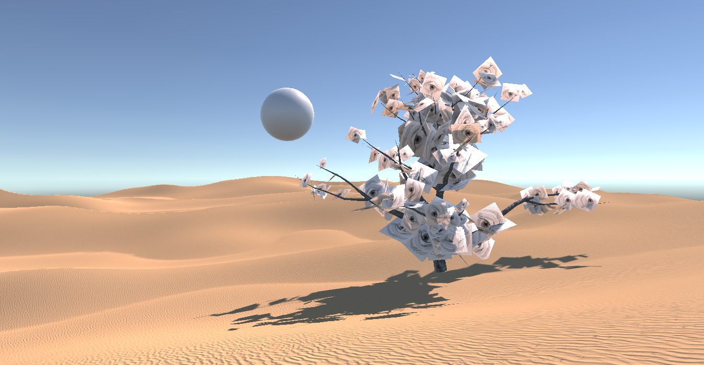
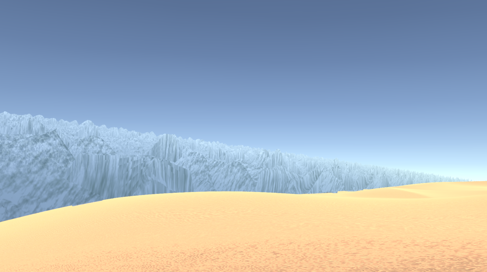
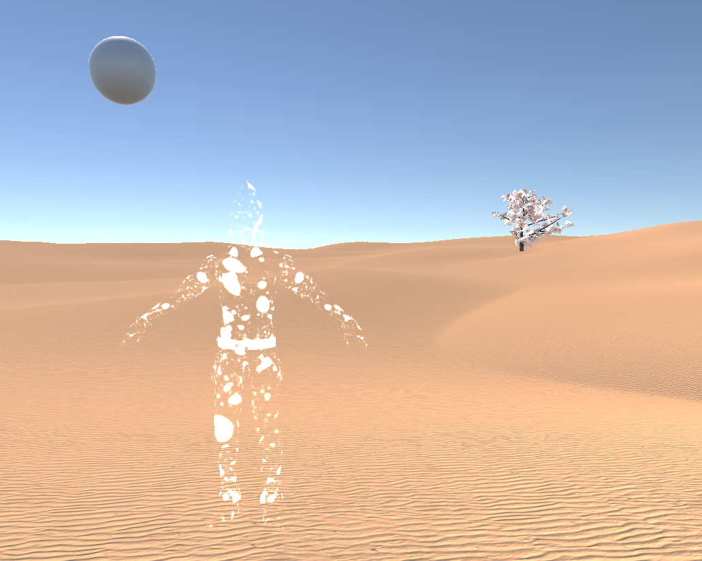
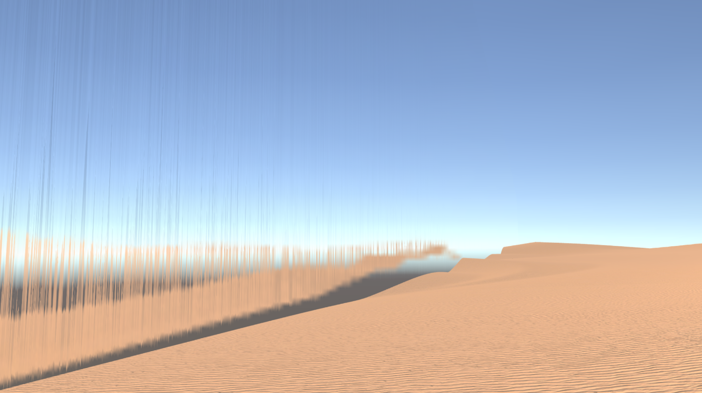
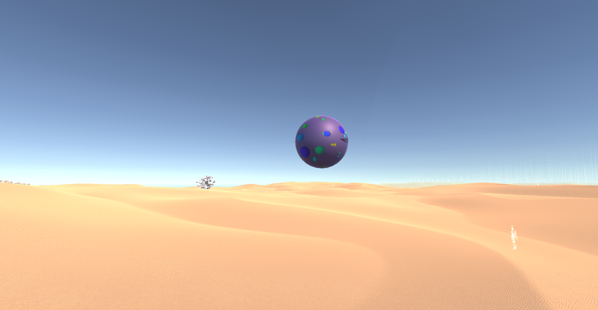
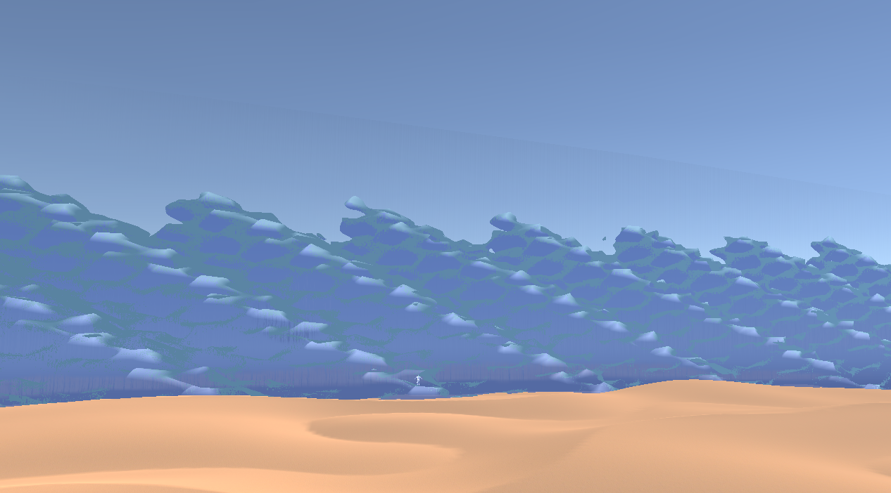
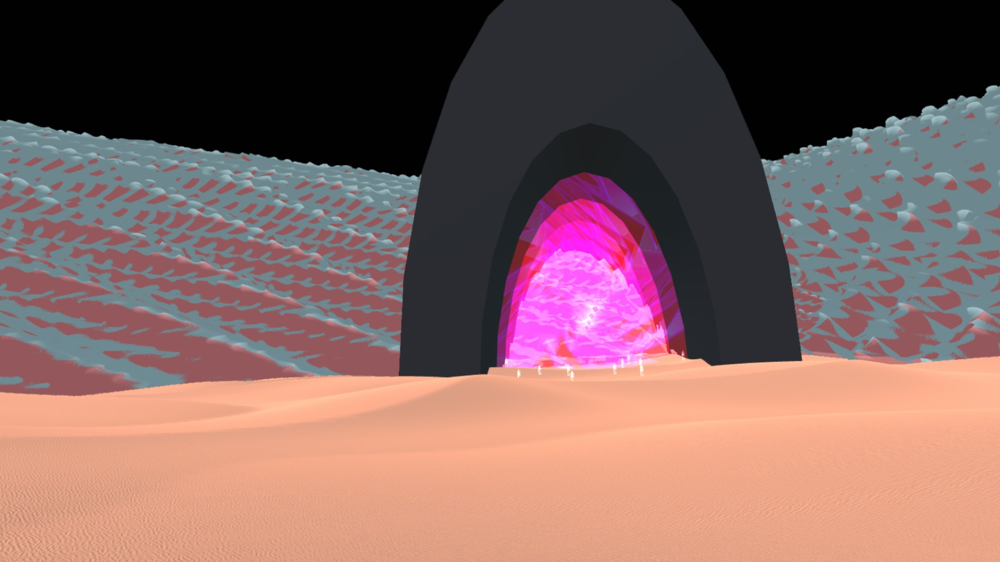
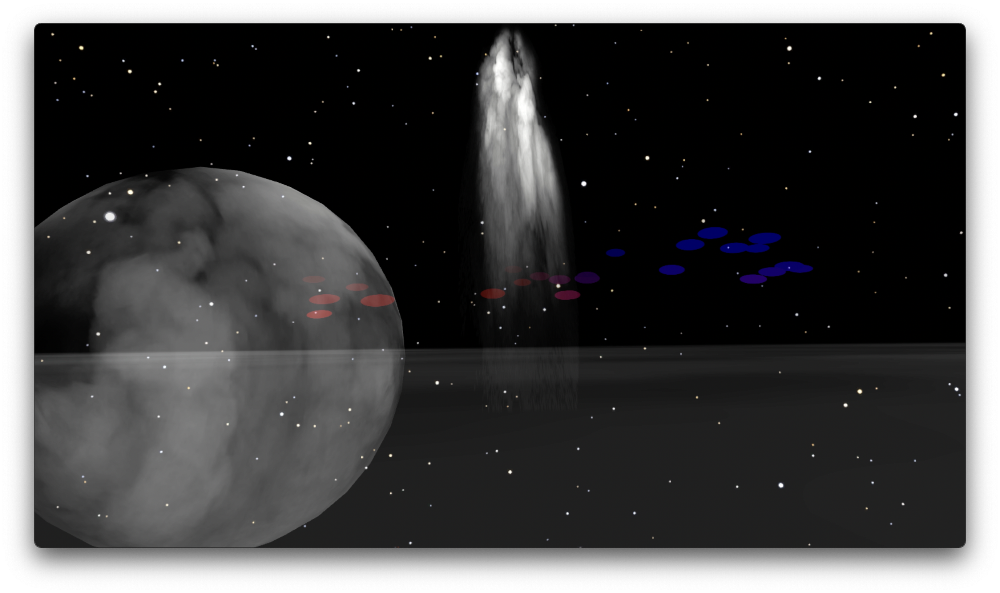
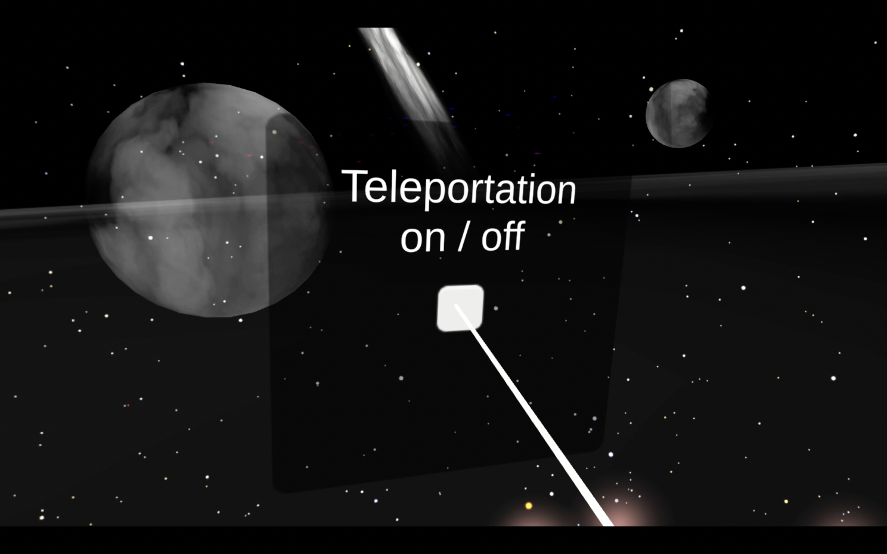

# Shortcut (First Term Project) Documentation

### 2021-11-25: First Steps
Up until now experienced script errors when trying to setup a Windows Mixed Reality VR session via the Mixed Reality Features Toolkit application and Windows tutorial. 

### 2021-11-30: Technical Progress
Decided to use the built in VR Base unity template builder for a VR setup, and it seems to be working so far. Followed [this tutorial](https://circuitstream.com/blog/vr-locomotion/) for XR scene setup and locomotion. Could not really get locomotion to work and then did research only to find that there could be cross compatibility problems as the VR Base unity preset most likely did not include the necessary Windows Mixed Reality assets that I needed. 

Went back to try with the [Windows MRTK Sollution](https://docs.microsoft.com/en-gb/learn/modules/learn-mrtk-tutorials/1-5-exercise-configure-resources), but this time with the recommended 2020.2.* Unity build. I was previously using a 2021 build and had learned that a newer version, does not mean a better more more compatible version when it comes to Unity updates... 

Note: Step 5 on page 5 of 9 in the above MRTK sollution could be a point of faliure. 
It's recommending me to go with OpenXR setup and to **not** select Windows Mixed Reality - which seems counterintuative. 


Page 7 of 9:
The **ObjectManipulator script** makes an object movable, scalable, and rotatable using one or two hands.

GOT CONTROLLER TRACKING AND TELEPORTATION!
Essential Steps:
- Instal MRTK assets INCLUDING input tools (this is left out of the main HP setup tutorial from windows...)
- Enable ReverbG2 controller profile in interaction profiles. edit -> project settings -> OpenXR
- Download XR Interaction Toolkit (NONE of the windows tutorials talk about this)


### 2021-12-01: Replacement of GPT-2 Integration?
Idea to include Processing / three.js in the VR world.
I would really like to work on the coding side of things as its a skill I really value and am intrigued by. The integration of the mirror and AI interaction could be too challenging for the scope of a first term project, so I was considering to impliment animated patterns based on Processing sketches and / or 3D objects inside the VR space made in three.js.

### 2021-12-09: Language Generation Instead of GPT-2
[RITa](https://rednoise.org/rita/#examples) is a language generator tool for p5.js and processing (+ more). 

> Features include an integrated scripting language ([RiScript](https://observablehq.com/@dhowe/riscript)), a letter-to-sound engine, grammar and Markov-based text generation, tools for inflection, conjugation, stemming and tokenization, and analysis of English features such as part-of-speech, phonemes, syllables, and stresses.

### 2021-12-10: Questions and Concerns
- The final step of compiling the unity project into an app is a massive unknown. 
- Also, one of the project criteria is "flexibility". It's another big task to take into account hardware compatibility and controller bindings. 
- Could the project be run fro my computer, with my headset and from Unity? No doubt his will reduce the quality of my submission, but it would take a lot of load off from the final stages of compiling and preparing for "distribution". 
- The large degree of technical problems that I could face when dealing with Unity and VR could hinder the project greatly and leave me with a disappointing result. Perhaps switching to my alternative idea of a website audio player that plays continuously across pages, is more feasible considering it also takes into account the content we are learning in class. 

### 2021-12-13: Adding Terrain
Bought the Sahara Desert unity asset and placed in the environment. 
It definitely looks better from afar... But already I can move around on the dunes!
email blacksun.unityassets@gmail.com about missing mono script

Rebuilding without MRTK media toolkit component as it added a lot of functionality in it's own interface. It does work and it has got me moving quicker, but there is such poor documentation for it that I can't troubleshoot or figure out how to do extra things (ie continuous movement).
I'm going to rebuild using a regular per component setup so I can follow along with tutorials and also troubleshoot more easily as this setup is very similar to how many other devs are doing it. 

This tutorial set me up in a quarter of the time of the MRTK windows tutorials... 
https://www.youtube.com/watch?v=1VC3ZOxn2Lo

Stuck trying to figure out how to not have my character fall through meshes... 
Tried character controller and driver, but didn't work. 

### 2021-12-14: Successful Collision 

 Now gravity is working for the player and I can walk on the Sahara terrain!
 Needed to add Character Controller to the XR Rig. 
 Character Controller Y Center and level offset need to work together in that *level offset* is starting the player way up where the desert is and *controller Y center* is offsetting the position of the camera view.  
 
 Questions: How to add processing sketches on a sphere?
 
 ### 2021-12-18: References
 [Youtube: Add video in Unity, also on a sphere](https://www.youtube.com/watch?v=KG2aq_CY7pU)   
 [Youtube: Export 360 video from Unity](https://www.youtube.com/watch?v=9WEjMckJPFY)   
 [Unity Recorder Package](https://docs.unity3d.com/Packages/com.unity.recorder@2.0/manual/RecorderWindow.html)   
 
 ### 2022-01-04: Audio Work
 Added ambient wind audio and footstep sound effects. 
 [Footstep sound effect script tutorial](https://www.youtube.com/watch?v=ih8gyGeC7xs)
 Look at [Wind Zones](https://docs.unity3d.com/2019.3/Documentation/Manual/class-WindZone.html) and [Particle Systems](https://docs.unity3d.com/2019.3/Documentation/Manual/class-ParticleSystem.html) for making the wind more realistic.
 
 Added wind zone and also trialled the idea of a "dream tree" (pictured below).  



 ### 2022-01-05: Reference for Avatar Design
[Dust storm tutorial](https://www.youtube.com/watch?v=c_FJ2L3EvJM). Maybe this can also be a cheap quick hack to get the "sand walker" VR hand prefab going?
Revisit old track "sand" for implementation into the project. Will fit well. 

### 2022-01-08: End of Map Idea
[In game settings UI Youtube tutorial](https://www.youtube.com/watch?v=__iTtJHZg6k)
Visual world integration idea: extend the desert, but shroud it in ever thickening mist. The further you go in, the more you lose sight of the main area and you start to hear hellish shreeks of lost souls. 

### 2022-01-27: Thoughts Update
Added dust particle system but made it surreal, in that the dust particles are red spikes that float through the air, instead of puffs of sand. I'm enjoying experimenting with how to use unity "incorrectly", in order to achieve strange results, which will ultimately assist my project. 

Figuring out how to creatively deal with the edge of the map is difficult. I had the idea of making a sand storm at the edges of the map, but I can't seem to create a dust particle system thick enough. I may need to create many instances of smaller particle systems, as it seems like scaling the shapes of the dust particle systems means that there is too much space for too few particle instances (even when putting the particle count to stupidly high numbers. I don't really see a change).

Reinvigorated my idea of the liquid mirror by creating a portal like vertical water edge to the map. It looks cool, but when in VR, it kind of looks like it's an graphics glitch, and you can still see through the water, which makes the effect less interesting.


Do I need to add a Capsule Collider to XR rig?

Added prefab elements to the scene, but they disappear on play... No sollution so far. Very strange problem...

### 2022-29-01: Progress
Prefabs don't disappear now.
Added a human character prefab to the scene. Quite astounding how much more immersive the whole scene feels when you have a human figure in view. 
I would like to try and animate him, so that he runs into view, creating this sudden shift of perception in the mind of the user (from fake world, to something a little more tangible...).


Ooooooh yeah. Spooky. Now we're getting somewhere!

Spooky space child should have trail of ethereal children's choir melodies emanating from him. 
Will also help the user to orientate / become aware of him as he runs around.

[NavMesh Baking Tutorial](https://learn.unity.com/tutorial/navmesh-baking#)

```c#
// Custom Move to Central Tree script

using System.Collections;
using System.Collections.Generic;
using UnityEngine;
using UnityEngine.AI;

public class MoveTo : MonoBehaviour

{

 public Transform goal;
 // Start is called before the first frame update
 void Start()
 {
 NavMeshAgent agent = GetComponent<NavMeshAgent>();
 agent.destination = goal.position;
 }
  
 // Update is called once per frame
 void Update()
 {}
}

```


Experimenting further with creating an interesting map boundry. 
An endless ocean looks nice, but it's a bit of a basic idea and almost cheap trick to just maroon someone on a desert island...  
Here I'm playing with exaggerated water shader settings:


I think this is more in the right direction - keeps it more surreal.

### 2022-02-07: VR Chat?
What about uploading the level to VR Chat as a presentational medium?
Would also make delivery and access to the project less troublesome. 

### 2022-02-08: Video Test as Texture Tests

Video test on sphere. Super easy. Just need to be conscious of how the video wraps around an object, and design my processing sketches around that.   
I would think that when an object exits the screen, to then redrawn it on the other side will work totally fine - as at least by default, unity is wrapping the video window by width around an object.


Trialled using a rotated water texture to blend the main ocean out in an interesting way. At the intersection with the main ocean it looks nice, but it has a visible edge in the air, which detracts from the effect. Not worth it. 

### 2022-03-07
Imported the processing sketches into the VR world. The sphere sketch "Grow Roots" is working well. I'm happy with the effect.    


Rendering video on objects is easy in Unity if the concept is simple (ie covering all surfaces of an object). The idea of rendering my [recursive sketch](../PROCESSING/Recursive_1_0/Recursive1.0.gif) on the inside of a convex hemisphere turned out to be way too problematic, so I ditched the idea.    
I subsequently the thought to simulate a portal / teleportation idea with the same sketch, which was also going to be a good creative solution for getting people back into the map who fall off the edge and into the "underworld" (ie run into the center of the hypnotic spiral and spawn back at the central tree). I spent a good 3 - 4 hours trying all the various approaches to trigger collision respawning in Unity. But regrettably nothing worked. 

Falling into the "underworld" is an intended part of the experience, so I then used the recursive sketch as an invitation to do this. I layered multiple renders of the video on transparent planes inside an arched tunnel, and also gathered all the little spirit children in the tunnel, making them walk slowly out of it. I hope people get intrigued enough to walk through the tunnel - inevitably falling off the edge.     


### 2022-03-08
Added all the music and audio today and it's really made the world come together! Feels very mysterious and dream like now. Also touched up the sand footstep sounds and did some post-processing in Izotope RX7 so that it sounds much more 3D (it's not really working to use the inbuilt spatialisation of unity for the footsteps as they're directly beneath the main camera view and is therefore creating some weird effects).

Reworked the recursive sketch so that it looked better inside the tunnel. Namely, reduced the amount of recursive shapes and changed colour palette.    

I also finished building the "underworld", also exporting the "Float Ceiling" sketch at a wider format with a further Z axis in the processing sketch - to stop the balls reaching the edge of the screen and getting cut off on the edge of the canvas. Now they really look like they're launching out of space!    



Implemented some scripting to only play sand footstep sounds when walking on the sand terrain (significant help from Sebastian Wilhelm for this). Also started on the teleportation / continuous movement in game UI, but am really considering not including it as using teleportation in this world really takes away from the feeling of realism. I had originally considered to provide the option of teleportation to accommodate people with motion sickness, but the environment is so sparse that I don't think motion sickness will be much of a problem at all. 

### 2022-03-09
Built the UI for teleportation / continuous movement. Found a great tutorial for it that worked a treat, so I owe a lot to that guy. But! The booleans he wrote in the code were incomplete, which I was able to quickly identify and fix when it initially wasn't working. Moments like these make me realise that I am indeed getting ahead with the coding side of things.     


During the demo recording process I became aware of how little I actually liked the surrounding oscillating red / blue water walls. In this moment I identified that my desire to include the walls stemmed from having not created an endless desert as originally intended. So psychologically, I wanted to "block" this out of perception by creating walls behind which you can't see.    
But after integrating the basement level of the map, which itself took on more of a space theme, and then later adding the star Skybox, I came to a appreciate again the aesthetic of a wall-less map, even if the desert terrain does suddenly end.    
This lead me to play with this idea of the terrain ending in the basement level. By using a particle cloud effect that is centrally focused (ie more cloud fluff in the middle of the image), I was able to create a plane of smoke which the player walks on. The smoke becomes thinner and thinner the further you walk out on the map, until it becomes completely transparent and you are left floating in space. But it's a fun test for the player; how far can you walk before you fall?

So it was a late realisation, but through the above mentioned process I've ended up with a map that fits my original intended aesthetic and emotional feel much more closely than if I had kept the walls. Furthermore, the two levels feel more balanced with one another, which has created a stronger connection between them, and a clearer sense of story telling when moving between them (via the cloud ramp).


### Final Notes
Overall, I'm very happy with the end result considering it was my first time building anything in Unity or VR. The creative coding side in Processing was very fun and I found that with each sketch I was able to go from idea to creation much faster and smoother. I'm also happy how the two mediums combined in so far as mapping the Processing sketches into the VR world. Having the VR world as the final viewing medium also incited me to think more openly and creatively when designing the Processing sketches themselves.    
To me, this was a great experience as one of the larger concerns with digital art in my opinion is how it gets presented for viewing. This also shows a great use of VR for the digital art world, as with VR we can experience digital art in it's natural habitat, so to say. 
So to have gone through the process of addressing these questions and curiosities in myself to do with digital art and the use of VR is very valuable to me.  

In terms of the development process of the project I'm also happy. My planning, time management and documentation was largely effective at keeping me on track both technically and creatively. I came very close to not getting the teleportation / movement UI menu done. This was because of a really strange bug that came from the water walls I had originally. The walls were somehow messing with the raycasting of the controllers so that their reticles would stick to the UI element and once stuck, never become unstuck no matter how far in the other direction the controllers were rotated. So I gave up with it at that point but luckily decided to return to trying to build the UI menu **after** the walls were removed due to aesthetic reasons... Sometimes it happens like that I suppose. 

